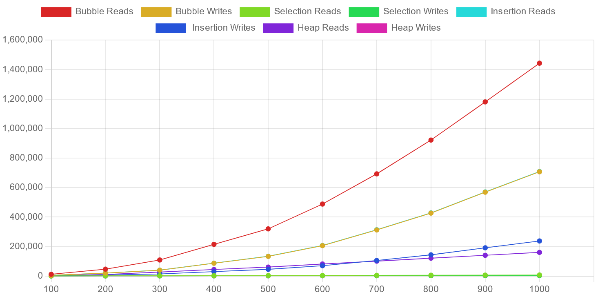
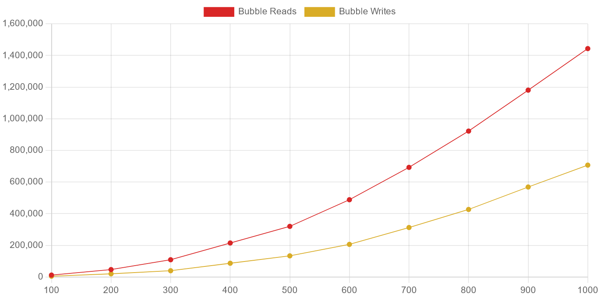
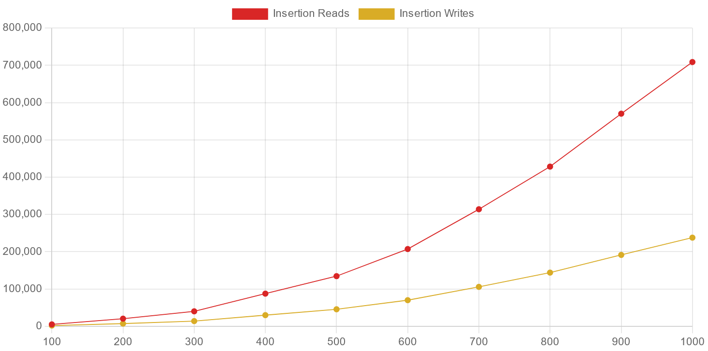
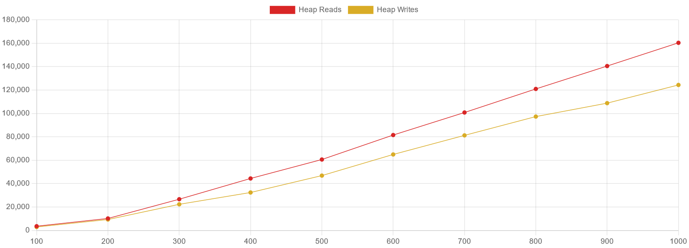
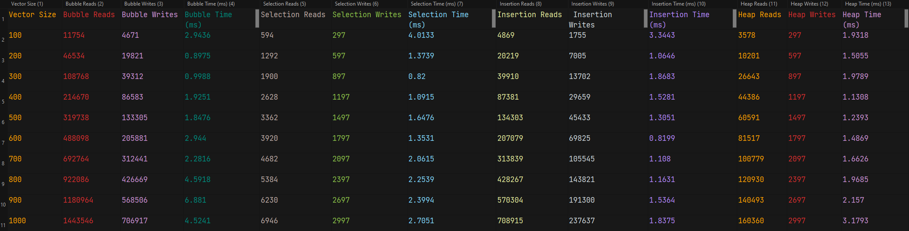

# CS2240 Project 4 - Aaron Luciano
**Sorting Algorithms** 
*11/6/2023*

* **Information about your data set** 
  * The data was all accumulated from my own personal playlists on spotify. They were not all one large playlist,
    but rather I had to convert the multiple CSV files into one general CSV file called "merged-playlists.csv"
    through the use of windows' built in terminal. To acquire all the CSV files, I used https://exportify.net,
    more information on the website. *Note*: When sorting this data for the project, 
    I chose to sort the release years only. 
     

* **Analyze the data. Graph the number of reads and writes, and compare and contrast.** 
  * All Songs Sorted:
  
    * _Note: it is hard to read exactly which line is which, so more graphs will provided for each
    sorting algorithm. The x-axis represents the size of the vector at a given point, and the y-axis
    represents the total amount of either reads or writes (hence two lines for each)_  
  * Bubble Sort:
    
    * Reads and writes grow quadratically with the size of the vector.
    * For a vector of size 100, it performs 11,754 reads and 4,671 writes.
    * For a vector of size 1000, it performs 1,443,546 reads and 706,917 writes.
    * The quadratic growth is consistent with the O(n^2) time complexity of Bubble Sort.  
  * Selection Sort:
    
    * The number of reads grows quadratically, but the number of writes remains relatively low compared to reads.
    * Reads grow from 594 to 6,946, while writes only grow from 297 to 2,997.
    * This suggests that while Selection Sort also has an O(n^2) time complexity, it does fewer writes 
    than the other sorting algorithms, potentially making it more efficient in scenarios where writes are 
    more expensive than reads.  
  * Insertion Sort:
    
    * The number of reads and writes also grows quadratically.
    * Starts at 4,869 reads and 1,755 writes and goes up to 708,915 reads and 237,637 writes.
    * Insertion Sort is typically more efficient than Bubble Sort and Selection Sort for small or 
    nearly sorted datasets because it can terminate early if the elements are already sorted, 
    but this advantage diminishes with larger random datasets.
      * You can see with this dataset, while it did perform better than bubble sort, it still was very expensive
      with both its amount of reads and writes--especially compared to selection sort.  
  * Heap Sort:
    
    * The number of reads and writes grows more slowly than the other sorting algorithms.
    * For a vector size of 100, there are 3,578 reads and 297 writes, growing to 160,360 reads 
    and 2,997 writes for a vector size of 1000.
    * Heap Sort has a time complexity of O(n log n), which explains the slower growth rate 
    compared to the other sorting algorithms.
    * In this instance, Heap Sort performed identically with the amount of writes to selection sort, however
    it had a _significant_ amount more of reads comparatively.  
  * Conclusions with this information:
    * In general, Heap Sort _is_ more efficient than the other algorithms for larger datasets since it has a lower 
    time complexity (O(n log n) vs O(n^2)), however in this instance, selection performed better than all others.
      * The data only being in a range of 45 years (1977-2022) is the most likely reason as to why selection performed much
      better than others. On top of that, selection being unstable means that it doesn't have to check value
      against another if they end up being the same year, and having so much overlap in years from the song data
      helped it perform the quickest of all others. Additionally, the data-set may have been partially sorted
      beforehand, as the csv file of all the songs and their data is based on the order in which the user added
      them to the playlist. In this regard, they may have added songs and or albums all from one year, which
      would therefore cause partially sorted segments of the dataset.
    * The quadratic complexities (O(n^2)) of Bubble, Selection, and Insertion Sorts make them inefficient for 
    large datasets as the number of operations increases dramatically with the size of the input. Again though,
    this particular dataset had a very glaring exception as mentioned previously.  
  * Table of the data and times:
  

* **Additional Sources** 
  * Timing Algorithms Reference: https://www.geeksforgeeks.org/measure-execution-time-function-cpp/
